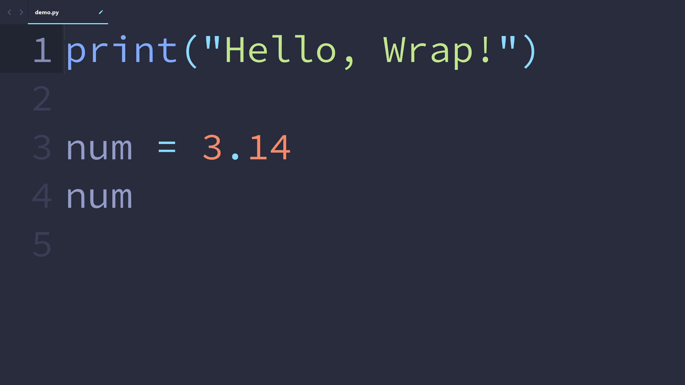

# 🤖 Wrap

[Wrap](https://github.com/futureprogrammer360/Wrap) is a simple but useful [Sublime Text](https://www.sublimetext.com/) plugin that wraps the selected text (or text under cursor) with brackets (example: pass as argument into function/method, pass as index/key into array/list).

## 🎬 Demonstration

</img>

## 💻 Installation

The easiest way to install Wrap is through [Package Control](https://packagecontrol.io/packages/Wrap). After it is enabled inside Sublime Text, open the command palette and find **Package Control: Install Package** and press `ENTER`. Then, find **Wrap** in the list. Press `ENTER` again, and this plugin is installed!

## 📈 Usage

This plugin includes the command `wrap`, which can be run in the command palette as `Wrap: Wrap`.

Running the `Wrap: Wrap` command, the text selected or under cursor will be wrapped by brackets (bracket type can be customized). A placeholder will be inserted before the starting bracket and become selected.

Example:

* Original code: `x` (`x` is selected or under cursor)
* After `Wrap: Wrap`: `abc(x)` (`abc` selected)

## ⚙ Customization

The Wrap plugin can be customized to your requirements.

### 🔧 Preferences

The type of brackets used by `Wrap` can be customized via the command `Preferences: Wrap`.

Simply change the `bracket_type` to your preference.

### ⌨ Keybindings

Keybindings can be created for the `wrap` command.

* Run the `Preferences: Wrap Key Bindings` command in the command palette.
* Add your keybindings!

Below is an example of the keybinding file:

```json
[
    {
        "keys": ["alt+w"],
        "command": "wrap"
    }
]
```
